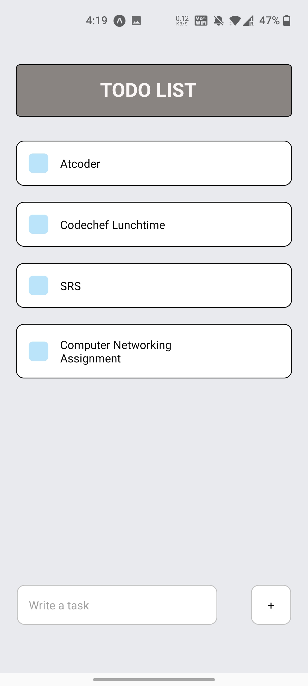

# Basic-Todo-Mobile-App

A simple Todo Mobile App for creating and deleting tasks

## Installation and Steps to run
Should have latest version of NodeJS 
Go to the App Directory and use the below command to run the App
 `expo start` 
  or
 `npm start` 

 Your application will be running on
 http://localhost:19002

 You can also download Expo Go app on playstore and scan the QR Code to view it on your mobile Screen
  
 

  

 
 
